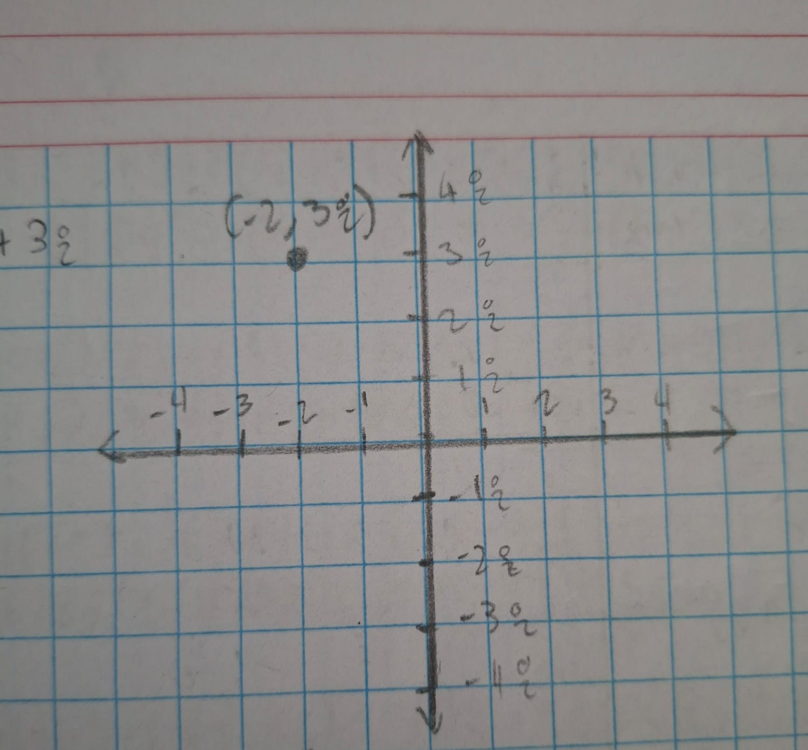
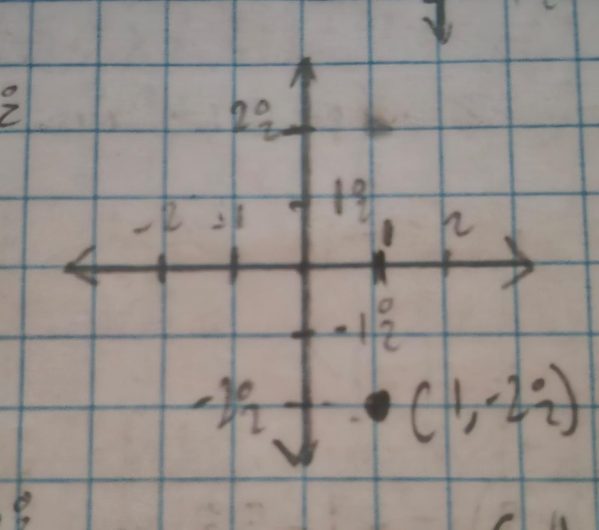
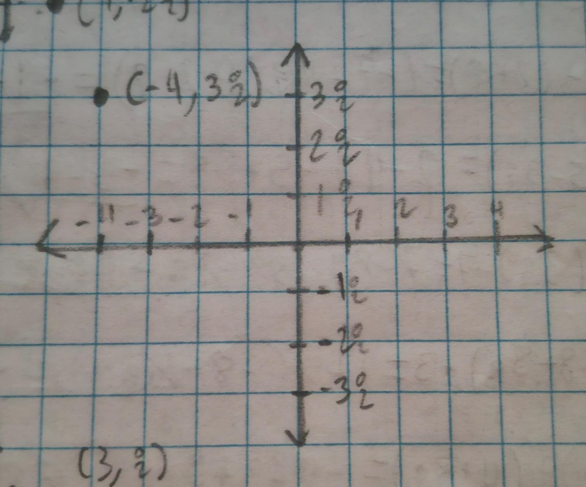
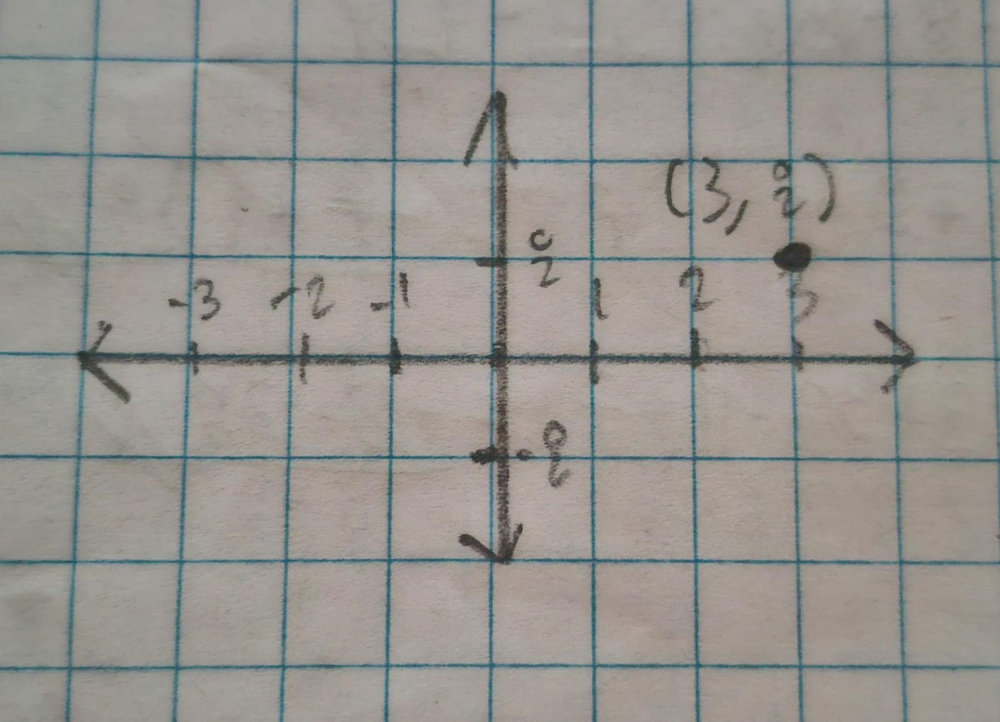
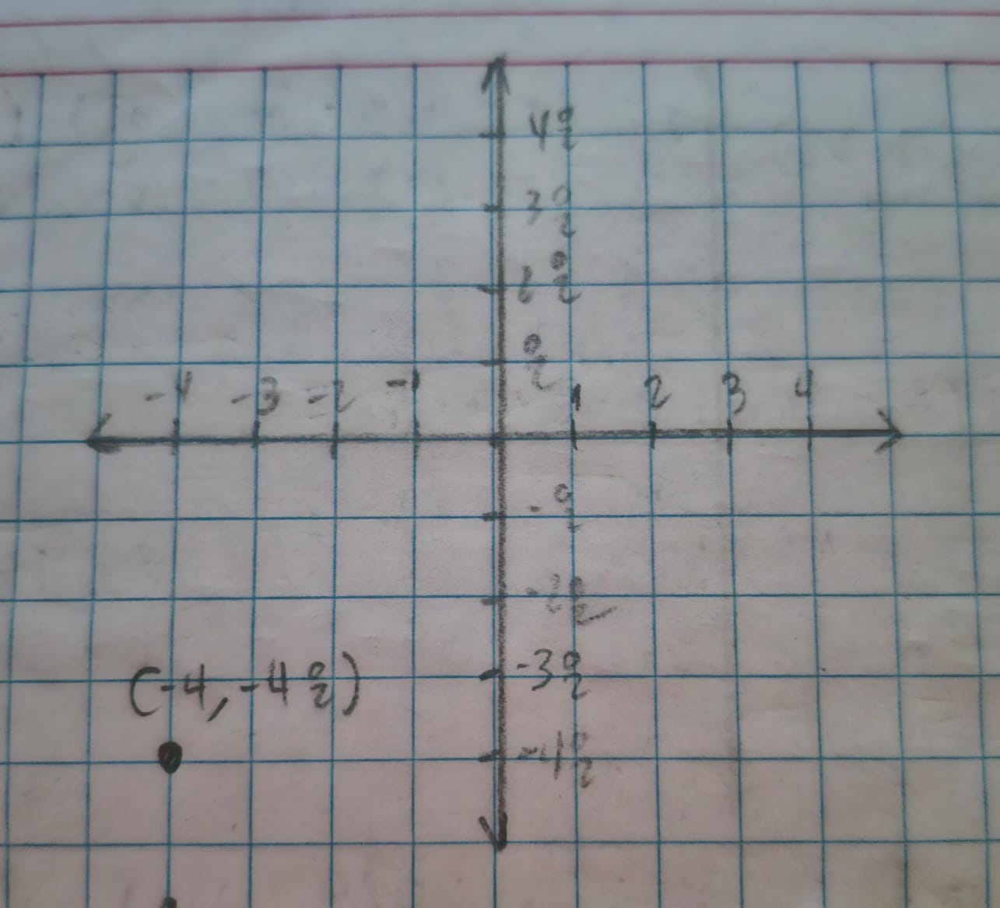
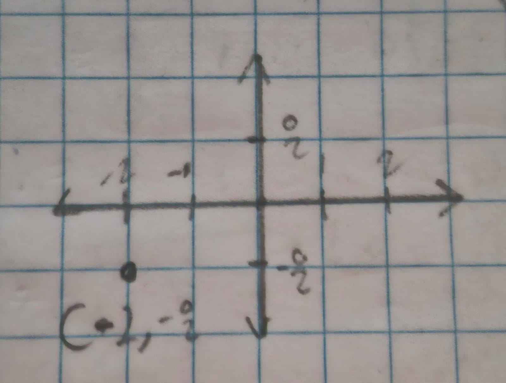

# Ejercicios de Números Complejos

## Ubicación en el Plano Complejo

Ubica los siguientes números complejos en el plano, identificando su parte real e imaginaria.

---

### 19. $-2 + 3i$

---

### 20. $1 - 2i$

---

### 21. $-4 + 3i$

---

### 22. $3 + i$

---

### 23. $-4 - 4i$

---

### 24. $-2 - i$

---
## Operaciones con Números Complejos

Resuelve las siguientes operaciones con los números complejos.

---

### 25. $(-7-4i)-(2+i)$

$$(-7-4i)-(2+i) = -9-5i$$

---

### 26. $(2-4i)-(5-3i)$

$$(2-4i)-(5-3i) = 2-4i-5+3i = -3-i$$

---

### 27. $(7-8i)-(3i)-7$

$$(7-8i)-(3i)-7 = 7-8i-3i-7 = -11i$$

---

### 28. $(1+5i)+(-8-5i)+3$

$$(1+5i)+(-8-5i)+3 = 1+5i-8-5i+3 = -4$$

---

### 29. $-8-(3-5i)+(4+8i)$

$$-8-(3-5i)+(4+8i) = -8-3+5i+4+8i = -7+13i$$

---

### 30. $(-4+2i)+(3i)+(-4-7i)$

$$(-4+2i)+(3i)+(-4-7i) = -4+2i+3i-4-7i = -8-2i$$

---

### 31. $(2i)(-4i)$

$$(2i)(-4i) = -8i^2 = -8(-1) = 8$$

---

### 32. $(-2i)(5i)\cdot 6$

$$(-2i)(5i)\cdot 6 = -10i^2 \cdot 6 = -10(-1) \cdot 6 = 60$$

---

### 33. $(-7i)(8+8i)(-2-8i)$

$$(-7i)(8+8i)(-2-8i) = (-56i-56i^2)(-2-8i) = (56-56i)(-2-8i)$$

$$= -112-448i+112i+448i^2 = -560-336i$$

---

### 34. $(-2-4i)(-1-6i)(7-6i)$

$$(-2-4i)(-1-6i)(7-6i) = (2+12i+4i+24i^2)(7-6i) = (-22+16i)(7-6i)$$

$$= -154+132i+112i-96i^2 = -58+244i$$

---

### 35. $(3i)(1-7i)(7+4i)$

$$(3i)(1-7i)(7+4i) = (3i-21i^2)(7+4i) = (21+3i)(7+4i)$$

$$= 147+84i+21i+12i^2 = 135+105i$$

---

### 36. $(-6i)(-5+i)(6-2i)$

$$(-6i)(-5+i)(6-2i) = (30i-6i^2)(6-2i) = (6+30i)(6-2i)$$

$$= 36-12i+180i-60i^2 = 96+168i$$

---

### 37. $\dfrac{10-7i}{1+3i}$

$$\frac{10-7i}{1+3i}\cdot\frac{1-3i}{1-3i} = \frac{10-30i-7i+21i^2}{1-3i+3i-9i^2} = \frac{-11-37i}{-10} = -1.1-3.7i$$

---

### 38. $\dfrac{4+2i}{-1-10i}$

$$\frac{4+2i}{-1-10i} \cdot \frac{-1+10i}{-1+10i} = \frac{-4+40i-2i+20i^2}{1-10i+10i-100i^2} = \frac{-24+38i}{101} = -0.237 + 0.376i$$

---

### 39. $\dfrac{1+4i}{-1-6i}$

$$\frac{1+4i}{-1-6i} \cdot \frac{-1+6i}{-1+6i} = \frac{-1+6i-4i+24i^2}{1-6i+6i-36i^2} = \frac{-25+2i}{37} = -0.675 + 0.054i$$

---

### 40. $\dfrac{-8+4i}{1+i}$

$$\frac{-8+4i}{1+i} \cdot \frac{1-i}{1-i} = \frac{-8+8i+4i-4i^2}{1-i+i-i^2} = \frac{-4+12i}{2} = -2 + 6i$$

---

### 41. $\dfrac{-10+8i}{6+i}$

$$\frac{-10+8i}{6+i} \cdot \frac{6-i}{6-i} = \frac{-60+10i+48i-8i^2}{36-6i+6i-i^2} = \frac{-52+58i}{37} = -1.405 + 1.567i$$

---

### 42. $\dfrac{2-2i}{4-10i}$

$$\frac{2-2i}{4-10i} \cdot \frac{4+10i}{4+10i} = \frac{8+20i-8i-20i^2}{16+40i-40i-100i^2} = \frac{28+12i}{116} = 0.241 + 0.103i$$

---

## Valor Absoluto de Números Complejos

Calcula el valor absoluto de los siguientes números complejos.

---

### 43. $\vert{-9-9i}\vert$

$$\sqrt{9^2+9^2} = \sqrt{81+81} = \sqrt{162} \approx 12.728$$

---

### 44. $\vert{8-6i}\vert$

$$\sqrt{8^2+(-6)^2} = \sqrt{64+36} = \sqrt{100} = 10$$

---

### 45. $\vert{6-3i}\vert$

$$\sqrt{6^2+(-3)^2} = \sqrt{36+9} = \sqrt{45} \approx 6.708$$

---

### 46. $\vert{10+10i}\vert$

$$\sqrt{10^2+10^2} = \sqrt{100+100} = \sqrt{200} \approx 14.142$$

---

### 47. $\vert{6-10i}\vert$

$$\sqrt{6^2+(-10)^2} = \sqrt{36+100} = \sqrt{136} \approx 11.661$$

---

### 48. $\vert{-1+7i}\vert$

$$\sqrt{(-1)^2+7^2} = \sqrt{1+49} = \sqrt{50} \approx 7.071$$

---

## Potencias de $i$

Resuelve las siguientes potencias de $i$.

---

### 49. $i^{5}$

$$i^{5} = i$$

---

### 50. $i^{10}$

$$i^{10} = -1$$

---

### 51. $i^{20}$

$$i^{20} = 1$$

---

### 52. $i^{35}$

$$i^{35} = -i$$

---

### 53. $i^{256}$

$$i^{256} = 1$$

---

### 54. $i^{5^{3}}$

$$i^{5^{3}} = i$$

---

## Forma Polar de Números Complejos

Convierte los siguientes números complejos a su forma polar.

---

### 55. $6-8i$

$$a = 6 \qquad b = -8$$

$$r = \sqrt{6^2+(-8)^2} = 10$$

$$\theta = \tan^{-1}\left(\frac{-8}{6}\right) = 306.869^\circ$$

$$\boxed{10(\cos 306.869^\circ + i\sin 306.869^\circ)}$$

---

### 56. $5\sqrt{2}+5\sqrt{2}\,i$

$$a = 7.071 \qquad b = 7.071$$

$$r = \sqrt{(5\sqrt{2})^2 + (5\sqrt{2})^2} = 10$$

$$\theta = \tan^{-1}\left(\frac{5\sqrt{2}}{5\sqrt{2}}\right) = 45^\circ$$

$$\boxed{10(\cos 45^\circ + i \sin 45^\circ)}$$

---

### 57. $2-2\sqrt{3}\,i$

$$a = 2 \qquad b = -3.464$$

$$r = \sqrt{2^2 + (-2\sqrt{3})^2} = 4$$

$$\theta = \tan^{-1}\left(\frac{-2\sqrt{3}}{2}\right) + 360^\circ = 300^\circ$$

$$\boxed{4(\cos 300^\circ + i \sin 300^\circ)}$$

---

### 58. $\dfrac{3\sqrt{3}}{2}-\dfrac{3i}{2}$

$$a = 2.598 \qquad b = -1.500$$

$$r = \sqrt{\left(\frac{3\sqrt{3}}{2}\right)^2 + \left(-\frac{3}{2}\right)^2} = 3$$

$$\theta = \tan^{-1}\left(\frac{-1.5}{2.598}\right) + 360^\circ = 330^\circ$$

$$\boxed{3(\cos 330^\circ + i \sin 330^\circ)}$$

---

### 59. $-2$

$$a = -2 \qquad b = 0$$

$$r = \sqrt{(-2)^2 + 0^2} = 2$$

$$\theta = \tan^{-1}\left(\frac{0}{-2}\right) + 180^\circ = 180^\circ$$

$$\boxed{2(\cos 180^\circ + i \sin 180^\circ)}$$

---

### 60. $-7i$

$$a = 0 \qquad b = -7$$

$$r = \sqrt{0^2 + (-7)^2} = 7$$

$$\theta = 270^\circ$$

$$\boxed{7(\cos 270^\circ + i \sin 270^\circ)}$$

---

## De Forma Polar a Forma Rectangular

Convierte los números complejos de su forma polar a su forma rectangular.

---

### 61. $\cos 30^\circ+i \sin 30^\circ$

$$r=1 \qquad \theta=30^\circ$$

$$a=1\cos 30^\circ = 0.866 \qquad b=1\sin 30^\circ = 0.5$$

$$\boxed{0.866+0.5i}$$

---

### 62. $2(\cos 60^\circ+i \sin 60^\circ)$

$$r=2 \qquad \theta=60^\circ$$

$$a=2\cos 60^\circ = 1 \qquad b=2\sin 60^\circ = 1.732$$

$$\boxed{1+1.732i}$$

---

### 63. $1.5(\cos 90^\circ+i \sin 90^\circ)$

$$r=1.5 \qquad \theta=90^\circ$$

$$a=1.5\cos 90^\circ = 0 \qquad b=1.5\sin 90^\circ = 1.5$$

$$\boxed{0+1.5i}$$

---

### 64. $2.5(\cos 120^\circ+i \sin 120^\circ)$

$$r=2.5 \qquad \theta=120^\circ$$

$$a=2.5\cos 120^\circ = -1.25 \qquad b=2.5\sin 120^\circ = 2.165$$

$$\boxed{-1.25+2.165i}$$

---

### 65. $4(\cos 135^\circ+i \sin 135^\circ)$

$$r=4 \qquad \theta=135^\circ$$

$$a=4\cos 135^\circ = -2.828 \qquad b=4\sin 135^\circ = 2.828$$

$$\boxed{-2.828+2.828i}$$

---

### 66. $3(\cos 180^\circ+i \sin 180^\circ)$

$$r=3 \qquad \theta=180^\circ$$

$$a=3\cos 180^\circ = -3 \qquad b=3\sin 180^\circ = 0$$

$$\boxed{-3+0i}$$

---

## Raíces de Números Complejos

Obtén **todas** las raíces de los siguientes números complejos.

---

### 67. 2 raíces cuadradas de $4(\cos 30^\circ+i \sin 30^\circ)$

$$r=4 \qquad \sqrt{r}=2 \qquad \theta=30^\circ \qquad n=2$$

$$k=0: \quad 2(\cos 15^\circ+i \sin 15^\circ) = 1.9318+0.5176i$$

$$k=1: \quad 2(\cos 195^\circ+i \sin 195^\circ) = -1.9318-0.5176i$$

---

### 68. 2 raíces cuadradas de $3(\cos 90^\circ+i \sin 90^\circ)$

$$r=3 \qquad \sqrt{r}=1.732 \qquad \theta=90^\circ \qquad n=2$$

$$k=0: \quad 1.732(\cos 45^\circ+i \sin 45^\circ) = 1.2247+1.2247i$$

$$k=1: \quad 1.732(\cos 225^\circ+i \sin 225^\circ) = -1.2247-1.2247i$$

---

### 69. 3 raíces cúbicas de $-4\sqrt{2}+4\sqrt{2}\,i$

$$a=-5.6568 \qquad b=5.6568$$

$$r=\sqrt{(-5.6568)^2+5.6568^2} = 8 \qquad \sqrt[3]{r}=2$$

$$\theta=\tan^{-1}\left(\frac{5.6568}{-5.6568}\right)+180^\circ = 135^\circ \qquad n=3$$

$$k=0: \quad 2(\cos 45^\circ+i \sin 45^\circ) = 1.4142+1.4142i$$

$$k=1: \quad 2(\cos 165^\circ+i \sin 165^\circ) = -1.9318+0.5176i$$

$$k=2: \quad 2(\cos 285^\circ+i \sin 285^\circ) = 0.5176-1.9318i$$

---

### 70. 3 raíces cúbicas de $-\dfrac{27}{8}$

$$a=-3.375 \qquad b=0$$

$$r=3.375 \qquad \sqrt[3]{r}=1.5$$

$$\theta=180^\circ \qquad n=3$$

$$k=0: \quad 1.5(\cos 60^\circ+i \sin 60^\circ) = 0.75+1.299i$$

$$k=1: \quad 1.5(\cos 180^\circ+i \sin 180^\circ) = -1.5$$

$$k=2: \quad 1.5(\cos 300^\circ+i \sin 300^\circ) = 0.75-1.299i$$

---

### 71. 5 raíces de $-32i$

$$a=0 \qquad b=-32$$

$$r=32 \qquad \sqrt[5]{r}=2$$

$$\theta=270^\circ \qquad n=5$$

$$k=0: \quad 2(\cos 54^\circ+i \sin 54^\circ) = 1.1755+1.618i$$

$$k=1: \quad 2(\cos 126^\circ+i \sin 126^\circ) = -1.1755+1.618i$$

$$k=2: \quad 2(\cos 198^\circ+i \sin 198^\circ) = -1.9021-0.618i$$

$$k=3: \quad 2(\cos 270^\circ+i \sin 270^\circ) = -2i$$

$$k=4: \quad 2(\cos 342^\circ+i \sin 342^\circ) = 1.9021-0.618i$$

---

### 72. 6 raíces de $729$

$$a=729 \qquad b=0$$

$$r=729 \qquad \sqrt[6]{r}=3$$

$$\theta=0^\circ \qquad n=6$$

$$k=0: \quad 3(\cos 0^\circ+i \sin 0^\circ) = 3$$

$$k=1: \quad 3(\cos 60^\circ+i \sin 60^\circ) = 1.5+2.598i$$

$$k=2: \quad 3(\cos 120^\circ+i \sin 120^\circ) = -1.5+2.598i$$

$$k=3: \quad 3(\cos 180^\circ+i \sin 180^\circ) = -3$$

$$k=4: \quad 3(\cos 240^\circ+i \sin 240^\circ) = -1.5-2.598i$$

$$k=5: \quad 3(\cos 300^\circ+i \sin 300^\circ) = 1.5-2.598i$$

---

### Binario a decimal

Realiza las conversiones de binario a decimal

---

### 73. $$00001111$$

$$1\cdot2^3+1\cdot2^2+1\cdot2^1+1\cdot2^0 = 8+4+2+1= 15$$

---

### 74. $$10011001$$

$$1\cdot2^7 + 0\cdot2^6 + 0\cdot2^5 + 1\cdot2^4 + 1\cdot2^3 + 0\cdot2^2 + 0\cdot2^1 + 1\cdot2^0$$
$$= 128 + 0 + 0 + 16 + 8 + 0 + 0 + 1$$
$$= 153$$

---

### 75. $11001100$ 
$$1\cdot2^7 + 1\cdot2^6 + 0\cdot2^5 + 0\cdot2^4 + 1\cdot2^3 + 1\cdot2^2 + 0\cdot2^1 + 0\cdot2^0$$
$$= 128 + 64 + 0 + 0 + 8 + 4 + 0 + 0$$
$$= 204$$

---

### 76. $01111011$  
$$0\cdot2^7 + 1\cdot2^6 + 1\cdot2^5 + 1\cdot2^4 + 1\cdot2^3 + 0\cdot2^2 + 1\cdot2^1 + 1\cdot2^0$$
$$= 0 + 64 + 32 + 16 + 8 + 0 + 2 + 1$$
$$= 123$$

---

### 77. $00000000\ 11111111$   (Equivale a $11111111$) 
$$1\cdot2^7 + 1\cdot2^6 + 1\cdot2^5 + 1\cdot2^4 + 1\cdot2^3 + 1\cdot2^2 + 1\cdot2^1 + 1\cdot2^0$$
$$= 128 + 64 + 32 + 16 + 8 + 4 + 2 + 1$$
$$= 255$$

---

### 78. $00000010\ 00000000$  
$$1\cdot2^9$$
$$= 512$$

---

### Conversiones de Binario a Octal

### 79. $11010101 \rightarrow (011)(010)(101)$ 
$011_2 = 3$
$010_2 = 2$ 
$101_2 = 5$

$$\mathbf{325_8}$$

---

### 80. $01101110 \rightarrow (001)(101)(110)$ 
$001_2 = 1$
$101_2 = 5$
$110_2 = 6$
$$\mathbf{156_8}$$

---

### 81. $10110011 \rightarrow (010)(110)(011)$   
$010_2 = 2$
$110_2 = 6$
$011_2 = 3$
$$\mathbf{263_8}$$

---

### 82. $00000000\ 11111111 \rightarrow (000)(000)(001)(111)(111)$   
$000_2 = 0$ 
$000_2 = 0$
$001_2 = 1$
$111_2 = 7$
$111_2 = 7$
$$\mathbf{377_8} \text{ (o } 00377_8\text{)}$$

---

### 83. $00000011\ 11000000 \rightarrow (000)(000)(011)(110)(000)(000)$  
$011_2 = 3$
$110_2 = 6$
$000_2 = 0$
$000_2 = 0$
$$\mathbf{3600_8} \text{ (o } 003600_8\text{)}$$

---

### 84. $00000101\ 01010101 \rightarrow (000)(000)(101)(010)(101)(010)(101)$   
$101_2 = 5$
$010_2 = 2$
$101_2 = 5$
$010_2 = 2$
$101_2 = 5$
$$\mathbf{52525_8}$$

---

### Conversiones de Binario a Hexadecimal

### .85. $11011010 \rightarrow (1101)(1010)$  
$1101_2 = 13 \rightarrow \text{D}$
$1010_2 = 10 \rightarrow \text{A}$
$$\mathbf{\text{DA}_{16}}$$

---

### 86. $01111100 \rightarrow (0111)(1100)$   
$0111_2 = 7$
$1100_2 = 12 \rightarrow \text{C}$
$$\mathbf{7\text{C}_{16}}$$

---

### 87. $10110101 \rightarrow (1011)(0101)$   
$1011_2 = 11 \rightarrow \text{B}$
$0101_2 = 5$
$$\mathbf{\text{B}5_{16}}$$

---

### 88. $11110000\ 10100101 \rightarrow (1111)(0000)(1010)(0101)$ 
$1111_2 = 15 \rightarrow \text{F}$
$0000_2 = 0$$1010_2 = 10 \rightarrow \text{A}$
$0101_2 = 5$
$$\mathbf{\text{F0A5}_{16}}$$

---

### 89. $00001111\ 00001111 \rightarrow (0000)(1111)(0000)(1111)$
$0000_2 = 0$
$1111_2 = \text{F}$
$0000_2 = 0$
$1111_2 = \text{F}$
$$\mathbf{0\text{F0F}_{16}} \text{ o } \mathbf{\text{F0F}_{16}}$$

---

### 90. $10000000\ 00000001 \rightarrow (1000)(0000)(0000)(0001)$ 
$1000_2 = 8$
$0000_2 = 0$
$0000_2 = 0$
$0001_2 = 1$
$$\mathbf{8001_{16}}$$

---

### Conversiones de Octal a Binario

### 91. $325_8$  
$3_8 = 011$
$2_8 = 010$
$5_8 = 101$
$$\mathbf{011010101_2} \text{ o } \mathbf{11010101_2}$$

---

### 92. $156_8$ 
$1_8 = 001$
$5_8 = 101$
$6_8 = 110$
$$\mathbf{001101110_2} \text{ o } \mathbf{1101110_2}$$

---

### 93. $377_8$
$3_8 = 011$
$7_8 = 111$
$7_8 = 111$
$$\mathbf{011111111_2} \text{ o } \mathbf{11111111_2}$$

---

### 94. $01777_8$ 
$0_8 = 000$
$1_8 = 001$
$7_8 = 111$
$7_8 = 111$
$7_8 = 111$
$$\mathbf{000001111111111_2}$$

---

### 95. $03700_8$  
$0_8 = 000$
$3_8 = 011$
$7_8 = 111$
$0_8 = 000$
$0_8 = 000$
$$\mathbf{000011111000000_2}$$

---

### 96. $05255_8$ 
$0_8 = 000$
$5_8 = 101$
$2_8 = 010$
$5_8 = 101$
$5_8 = 101$
$$\mathbf{000101010101101_2}$$

---

Conversiones de Hexadecimal a Binario

### 97. $\text{DA}_{16}$ 
$\text{D} = 13 \rightarrow 1101$
$\text{A} = 10 \rightarrow 1010$
$$\mathbf{11011010_2}$$

---

### 98. $7\text{C}_{16}$   
$7 \rightarrow 0111$
$\text{C} = 12 \rightarrow 1100$
$$\mathbf{01111100_2}$$

### 99. $\text{B}5_{16}$ 
$\text{B} = 11 \rightarrow 1011$
$5 \rightarrow 0101$
$$\mathbf{10110101_2}$$

---

### 100. $\text{F0A5}_{16}$  
$\text{F} = 15 \rightarrow 1111$
$0 \rightarrow 0000$
$\text{A} = 10 \rightarrow 1010$
$5 \rightarrow 0101$
$$\mathbf{1111000010100101_2}$$

---

### 101. $0\text{F0F}_{16}$ 
$0 \rightarrow 0000$
$\text{F} = 15 \rightarrow 1111$
$0 \rightarrow 0000$
$\text{F} = 15 \rightarrow 1111$
$$\mathbf{0000111100001111_2}$$

---

### 102. $8001_{16}$ 
$8 \rightarrow 1000$
$0 \rightarrow 0000$
$0 \rightarrow 0000$
$1 \rightarrow 0001$
$$\mathbf{1000000000000001_2}$$
